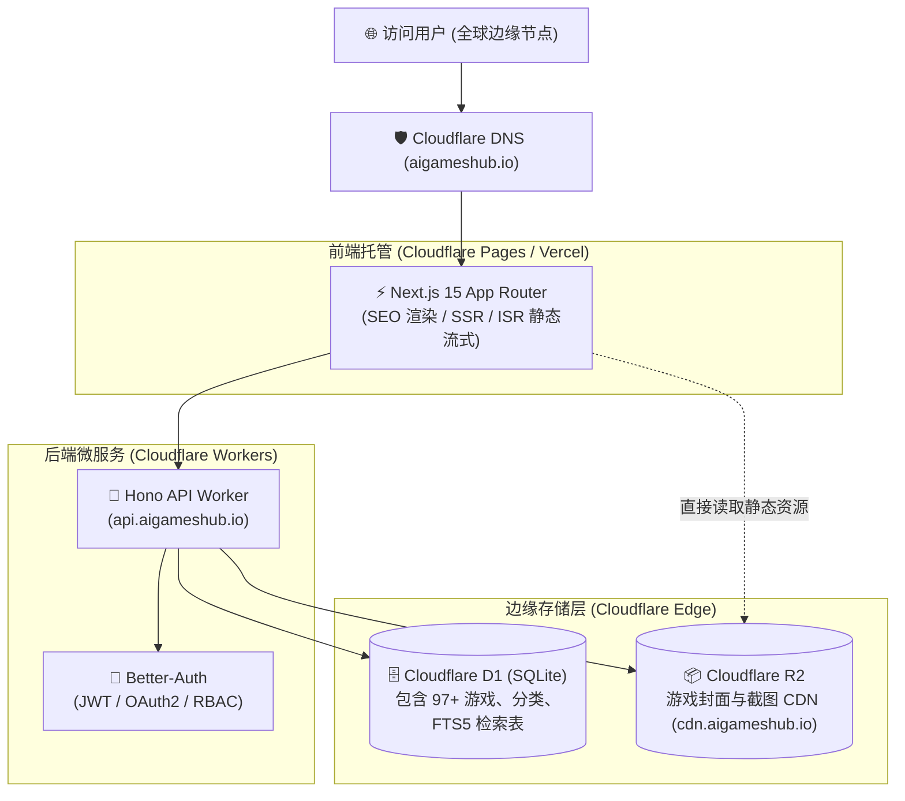

# AiGamesHub 生产环境完整部署指南 (Cloudflare 全栈架构)

本文档提供 **AiGamesHub (`aigameshub.io`)** 从零到上线的完整全栈部署指南。涵盖 **前端 Next.js 15 (App Router)**、**后端 Hono + Better-Auth + Drizzle ORM (Cloudflare Workers)**、**Cloudflare D1 边缘数据库 (含 FTS5 全文搜索)** 及 **Cloudflare R2 游戏封面对象存储**。

---

## 🏛️ 全栈架构概览



---

## 📋 准备工作

在开始部署前，请确保具备以下工具与账号：
1. **Cloudflare 账号**（免费版即可满足基本流量，D1/R2/Workers 均有丰厚免费额度）；
2. **Node.js** (v18.17+ 或 v20+) 与 **pnpm** (或 npm)；
3. 域名 **`aigameshub.io`** 已托管在 Cloudflare DNS；
4. 全局或本地安装的 **Wrangler CLI**。

---

## 🚀 第一阶段：部署后端 (Workers + D1 + R2 + FTS5)

### 步骤 1：登录 Cloudflare 账号

在本地终端进入项目目录并执行：
```bash
npx wrangler login
```
*浏览器会自动弹出 Cloudflare 授权页面，点击「Allow」完成登录认证。*

---

### 步骤 2：创建远程 Cloudflare D1 数据库

在项目根目录或 `backend` 目录下运行：
```bash
cd backend
npx wrangler d1 create aigameshub-db
```

执行后终端将输出类似以下信息：
```json
[[d1_databases]]
binding = "DB"
database_name = "aigameshub-db"
database_id = "xxxxxxxx-xxxx-xxxx-xxxx-xxxxxxxxxxxx"
```

---

### 步骤 3：更新后端配置文件 (`backend/wrangler.jsonc`)

打开 `backend/wrangler.jsonc`，将上一步获取的真实 `database_id` 填入：

```jsonc
{
  "$schema": "node_modules/wrangler/config-schema.json",
  "name": "aigameshub-api",
  "main": "src/index.ts",
  "compatibility_date": "2025-02-14",
  "compatibility_flags": ["nodejs_compat"],
  "d1_databases": [
    {
      "binding": "DB",
      "database_name": "aigameshub-db",
      "database_id": "你的真实_D1_DATABASE_ID" // 👈 替换此处
    }
  ],
  "r2_buckets": [
    {
      "binding": "R2_BUCKET",
      "bucket_name": "aigameshub-r2"
    }
  ],
  "vars": {
    "BETTER_AUTH_URL": "https://api.aigameshub.io",
    "BETTER_AUTH_SECRET": "生成一个32位以上的强随机密钥字符串",
    "CORS_ORIGIN": "https://aigameshub.io,http://localhost:3000",
    "PUBLIC_R2_URL": "https://cdn.aigameshub.io"
  },
  "observability": {
    "enabled": true
  }
}
```

---

### 步骤 4：创建 Cloudflare R2 存储桶

执行以下命令创建用于存放游戏封面的 R2 存储桶：
```bash
npx wrangler r2 bucket create aigameshub-r2
```

#### 配置 R2 公共访问（二选一）：
1. **推荐（自定义域名）**：在 Cloudflare Dashboard -> **R2** -> 选择 `aigameshub-r2` -> **Settings** -> **Custom Domains** -> 绑定 `cdn.aigameshub.io`；
2. **测试（R2.dev 临时域名）**：在同一页面点击 **Allow Access** 开启 Public Development URL（如 `https://pub-xxx.r2.dev`）。

---

### 步骤 5：初始化远程 D1 数据库结构与预置数据

在 `backend` 目录下依次运行以下命令，将建表、97+ 款预设 AI 游戏以及 FTS5 全文检索引擎导入远程 D1：

```bash
# 1. 执行初始表结构建表 (Games, Categories, Users, Sessions, Comments, Votes)
npx wrangler d1 execute aigameshub-db --remote --file=./migrations/0000_init.sql

# 2. 导入 97+ 款全量初始 AI 游戏数据与分类
npx wrangler d1 execute aigameshub-db --remote --file=./seed.sql

# 3. 初始化 SQLite FTS5 虚拟全文检索表与自动同步触发器
npx wrangler d1 execute aigameshub-db --remote --file=./src/db/fts.sql
```

> **验证数据库导入结果**：
> ```bash
> npx wrangler d1 execute aigameshub-db --remote --command="SELECT count(*) as total_games FROM games;"
> ```
> 终端返回 `total_games: 97` 即表示数据初始化成功！

---

### 步骤 6：发布后端 API 到 Cloudflare Workers

在 `backend` 目录下执行发布命令：
```bash
npx wrangler deploy
```

发布成功后，终端将输出你的 Worker 访问 URL（例如：`https://aigameshub-api.<你的用户名>.workers.dev`）。

#### 绑定自定义域名 `api.aigameshub.io`：
进入 Cloudflare Dashboard -> **Workers & Pages** -> 选择 `aigameshub-api` -> **Settings** -> **Domains & Routes** -> 点击 **Add Custom Domain** -> 输入 `api.aigameshub.io`。

---

## 💻 第二阶段：部署前端 Next.js 15

前端可选择 **Cloudflare Pages**（推荐）或 **Vercel** 进行部署。

### 方式 A：部署到 Cloudflare Pages（推荐）

1. 登录 [Cloudflare Dashboard](https://dash.cloudflare.com/)；
2. 导航至 **Workers & Pages** -> 点击 **Create Application** -> 切换到 **Pages** 标签 -> 选择 **Connect to Git**；
3. 选择你的 GitHub 仓库（`AiGamesHub`）；
4. 构建配置填写如下：
   * **Framework preset**：`Next.js`
   * **Build command**：`pnpm build` (或 `npx @cloudflare/next-on-pages@1`)
   * **Build output directory**：`.vercel/output/static` (或 `.next`)
   * **Node.js Version**：`20`
5. **添加环境变量（Environment variables）**：

| 变量名 | 推荐值 | 说明 |
| :--- | :--- | :--- |
| `NEXT_PUBLIC_API_URL` | `https://api.aigameshub.io` | 线上后端 API 地址 |
| `NEXT_PUBLIC_SITE_URL` | `https://aigameshub.io` | 线上站点根 URL (SEO / Sitemap) |
| `ADMIN_PASSWORD` | `你的高强度后台管理密码` | 首次登录 `/admin` 后台的独立密匙 |
| `NODE_VERSION` | `20` | 指定 Node.js 运行时版本 |

6. 点击 **Save and Deploy**，等待 1-2 分钟构建完成即可！

---

### 方式 B：部署到 Vercel

如果你习惯使用 Vercel：
1. 访问 [vercel.com](https://vercel.com) 并导入 GitHub 仓库；
2. 在 **Environment Variables** 中添加上述环境变量（`NEXT_PUBLIC_API_URL`、`NEXT_PUBLIC_SITE_URL`、`ADMIN_PASSWORD`）；
3. 点击 **Deploy** 即可一键上线；
4. 在 Vercel 项目设置中的 **Domains** 绑定你的顶级域名 `aigameshub.io`。

---

## 🌐 第三阶段：DNS 解析与域名配置

确保你的 Cloudflare DNS 控制台包含以下解析记录：

| 类型 (Type) | 名称 (Name) | 目标内容 (Content) | 代理状态 (Proxy) | 用途 |
| :--- | :--- | :--- | :--- | :--- |
| **CNAME** | `@` / `aigameshub.io` | 你的 Cloudflare Pages 或 Vercel 别名 | 🟢 Proxied | 主站入口 |
| **CNAME** | `api` | `aigameshub-api.<子域>.workers.dev` | 🟢 Proxied | 后端 REST API |
| **CNAME** | `cdn` | R2 Bucket 绑定的公共域名 | 🟢 Proxied | 游戏封面加速 CDN |

---

## 🛡️ 第四阶段：生产环境验证清单

部署完成后，请按照以下清单逐项验证：

- [ ] **首页访问**：打开 `https://aigameshub.io`，检查 97+ 款游戏卡片是否整齐渲染；
- [ ] **FTS5 全文搜索**：在顶部搜索框输入 `prompt`、`npc`、`detective`，验证毫秒级即时检索；
- [ ] **游戏详情与画廊**：访问 `https://aigameshub.io/games/ai-art-impostor`，点击缩略图测试横向滑动条与大图切换；
- [ ] **后台管理系统**：访问 `https://aigameshub.io/admin`，输入密码登录，检查游戏列表、数据统计与 `/admin/users` 权限管理；
- [ ] **R2 图片上传**：在后台 `/admin/games/new` 尝试上传一张游戏封面，确认能成功直传 R2 并生成 `cdn.aigameshub.io` 链接；
- [ ] **SEO 与 Sitemap**：访问 `https://aigameshub.io/sitemap.xml` 与 `https://aigameshub.io/robots.txt`，确保谷歌爬虫能正常抓取收录。

---

## 🔧 常用生产环境运维命令速查

```bash
# 1. 实时查看后端 API 线上运行日志 (含错误堆栈)
cd backend
npx wrangler tail

# 2. 远程查询线上 D1 数据库
npx wrangler d1 execute aigameshub-db --remote --command="SELECT count(*) FROM users;"

# 3. 远程备份线上 D1 数据库
npx wrangler d1 export aigameshub-db --remote --output=./backup_prod.sql

# 4. 手动更新某款游戏的推荐热度
npx wrangler d1 execute aigameshub-db --remote --command="UPDATE games SET is_hot = 1 WHERE slug = 'suck-up';"
```
